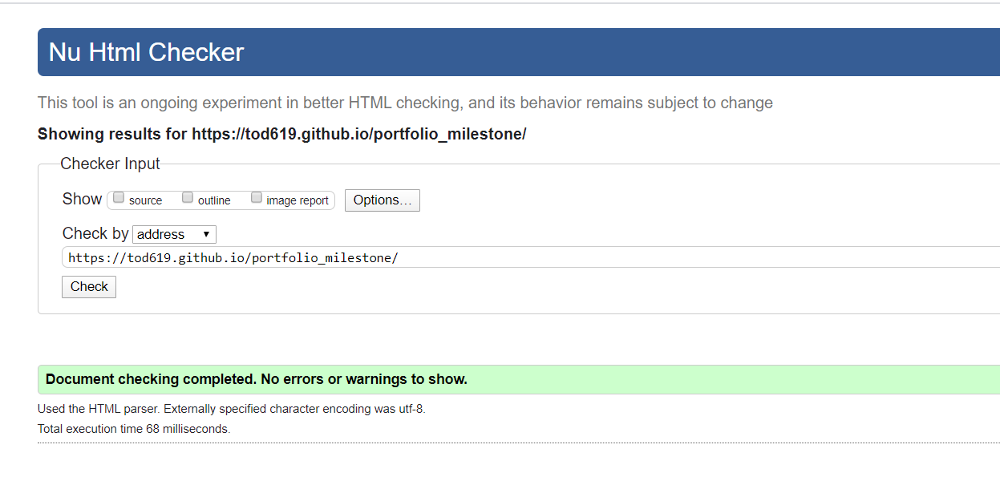
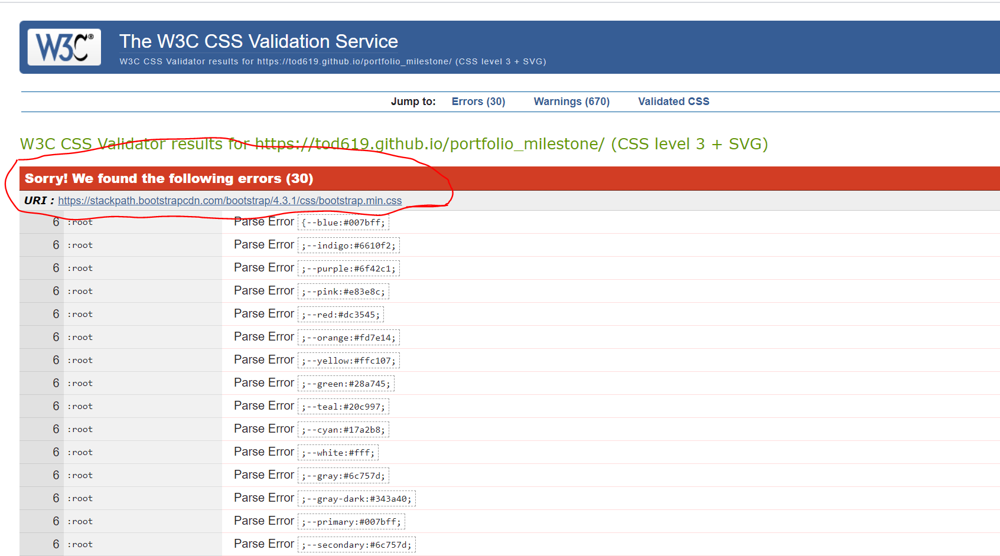
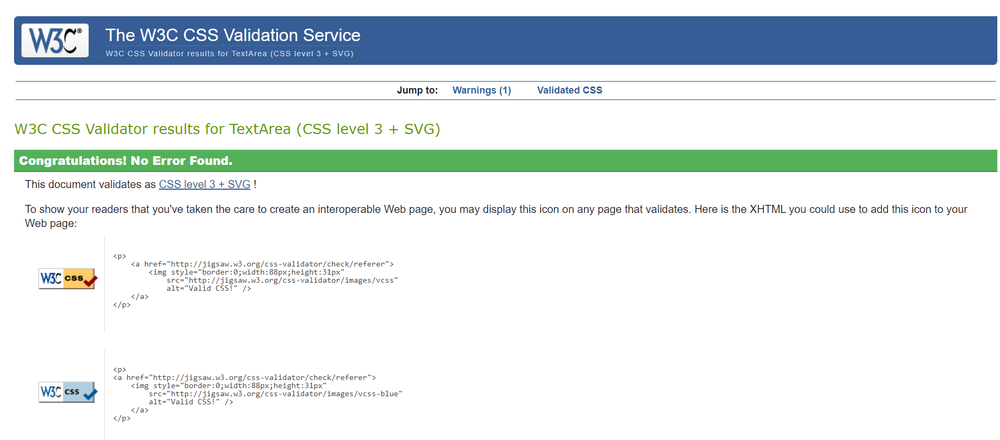
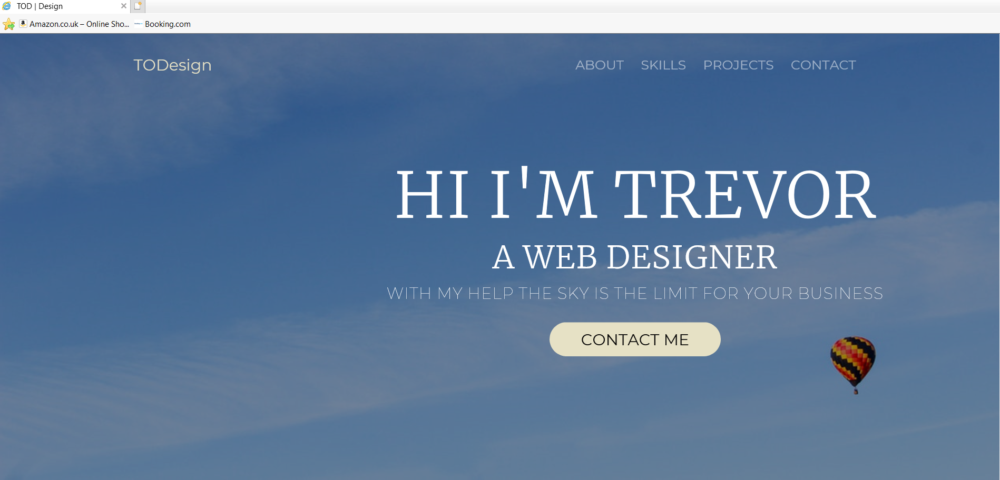

# portfolio_milestone

This project is designed as a one page portfolio project that will demonstrate my ability with using HTML and CSS. The project uses core front end technologies along with the Bootstrap front-end framework for added responsivness and for improved cross browser compatability. The site also takes advantage of Google Fonts to allow for more of a modern feeling typgrophy set.

## Demo

A live demo of the site can be found hosted on Github pages by following this link:

https://tod619.github.io/portfolio_milestone/

## Project Description

This project is a one page static portfolio site that I am using to highlight my skills and qualifactions when it comes to front end development. The project consits of seven sections, of which six are main sections that are used to guide the user to get to know more about me and my skills along with providing the user an easy way to contact me if they are interested in my work with a seventh section as the footer. The seven sections and their purpose are as follows:

1. Navigation Bar: this provides navigation around the site.
2. Showcase Section: this is expected to grab the users attention.
3. About Me: this highlights my personality and history.
4. Skills: this higlights my key skills and expertise.
5. Projects: this section draws the users attention to some of the projects that I have worked on.
6. Contact: this section consits of a form to contact me.
7. Footer: This final section is not considerd part of the main sections but it does contain some useful social media links that can be used as an alternative way of contacting me.

## Project Strategy

When creating this project I needed to develop an overall strategy and understand purpose of this project and to keep these ideas in mind when implementing the completed design. This project has a twofold purpose.

1. Demonstrate the skills that I have acquired from the Code Institute curriculam thus far and pass the assesment criteria of Code Institute.
2. Create a fully featured front end project that I can use to draw attention to my skills and attract potential employeers/clients.

With these criteria in mind I determined that a one page static site would be the best option. It would make navigation and organization of the data simple. It would allow me to showcase some of my design ability and allow me to focus on primarily HTML and CSS. The donwside of this approach meant that the site would lack overall complexity and I needed to be careful not to overload the user with too much information in the form of text as this could lead to a very cluttered looking site.

## The Scope of This Project

The main scope of this project was to demonstrate what I have learned thus far in the Code Institute course with regards to HTML and CSS. With this in mind I needed to be careful that I didn't get distracted with trying to be overly complex or to place to much emphasise on things such as JavaScript or JQuery that would not be part of the examination criteria.

A secondary part of the scope for me was to create an attractive site using the above mentioned technologies. For this reason I spent a bit of time deciding the best colour combination, the type of fonts, and the best layout options for this project.

## UI / UX

The layout and content of the site has been carfully curated to logically tell the user the story of my skill set.
The showcase section contains an eye catching heading that introduces me to the user and is designed to grab attention. The about me section informs the user about me and gives them a taste of my personality. The skill section highlights some of my skills and the tech stack that I am comfortable using. The projects section demonstrates the topics that I have discussed in my skills section. Finally the contact section allows the user to get in touch with me after they have learned about my personality, read about my skillset and seen a demonstration of those skills in the project section.

## User Stories

To help develop the site I created some user stories from my perspective as the site owner, along with user stories for potential employeers or clients. By doing this, it helped me to identify what was important information that needed to be included and also helped me to identify things that I could leave out so that the site doesn't become overly bloated with content or difficult to navigate.

### My Perspective:

1. As the owner I would like a site that will act as an introduction to potential employers/clients.
2. As the owner I would like a site that would highlight my technical skills.
3. As the owner I won't like a site that would showcase some of my projects.
4. As the owner I would like a site that would allow a member of the public to contact me.

### Users Perspective:

1. As a user I would like to get a feel for the person that I might hire by reading a bit about them.
2. As a user I would like to get a feel for the tech stack of the owner to see if it is compatible with my business.
3. As a user I would like to see a section of worked on projects as this would give me an ability to judge the site owners skills in a practical setting.
4. As a user I would like to be able to contact the site owner in an easy manner.

# Wireframes.

To help visualize the website I created wireframes of what the site would look like on desktop as well as what it would look like on mobile devices. The wireframes can be found here:

## Mobile Design

## Desktop Design

## Technologies Used

To complete this project I have used a variety of front end technologies.

1. HTML 5: Modern HTML with semantice elements to form the structure of the site.
2. CSS 3: Used to style the site includes flexbox and a grid system for modern layouts and responsive design.
3. Bootsrap: A front end framework that simplifies the grid system and comes with many components and utility classes that help make front end development as easier experience.
4. JQuery: A Javascript library that has been used to add a small amount of dynamism to the website.
5. Google Fonts: Allows for a wider choice of fonts.
6. Coolor.io: a website that was used to help pick the color palette for the site.
7. Github: Used for version control and to store a remote copy of the project.
8. Github pages: a feature of Github that allows us to deploy a static website and have it hosted online.
9. VsCode: An IDE (Integrated Development Environment) that was created by Microsoft was used to build the website.

## Design Decisions On The Surface Plain

To implement this project successfully I made certain design decisions that had an impact on the project some of these decisions are:

### Bootstrap

Bootstrap is used throughout this project. The use of Bootsrap was choosen as it presented many advantages. The main adavantages of Bootsrap was that it allowed for a complex page layout with the use of its grid system and flexbox utilities. Bootstrap also contains many useful margin and padding classes that reduced the need for repitive CSS and helped to keep my CSS DRY (Don't Repeat Yourself). Bootstrap also helped with cross browser compatability. The one downside to using Bootsrap is that it made the HTML code difficult to read and overly complex with regards to the many classes that are applied to the HTML elements. Another area this effected the code was when it came to refactoring the CSS as it meant adding utility classes for repitive code difficult to already class heavy HTML elements. One final area that Bootstrap had an negative effect on the project was when it came to testing using the CSS validator. The CSS validator did not regonize alot of Bootstrap CSS as valid and raised a lot of errors but if you copy and paste my code directly from style.css into the CSS validator it displays no errors.

### Container

I used the Bootstrap container class extensively throughout this project as I felt it improved the overall look of the site. The container-fluid class is ofter used as a default by alot of developers but i feel that it places content (espically text content) to close to the screen edges. Most peoples eyes are drawn towards the center of the screen and I feel that by using the container class it provides a better user experience. I also wrapped the contents of the navbar (brand and ul) in the container class as this brought all the content inline with each other. The fewer lines that you can trace across your page leads to a cleaner design and a nicer viewing experience.

### Fonts

The use of fonts was also carefully considered in this project. I choose Merriweather and Montserrat fonts as both of these fonts are popular among web designers, along with being versitle and modern looking. Merriweather also pairs well with Montserrat in regards to readability and style. Both fonts can be used as either heading or paragraph text and I feel that this combonation of fonts strikes the right chord between traditional and modern design.

### Colours

The main colours that I have choosen for this site are a steele blue, light blue and a hint of fresh air blue. For the text I used a smokey black colour along with a pearl white for an additonal contrast and for use in empty space. The primary reasons for choosing blue as the main colour is its popular with web design in general (Think of big sites like facebook and twitter). Also it is an extremly popular colour among both men and women, with a recent study showing men prefering it 42% of the the time and women 29% of the time. Blue also has a calming effect on the viewer and is also a colour used to inspire trust in people (think of police officers or docotors and nurses in hospitals).

### Text

For this project I did my best to keep the amount of text to a minimum so as to not overwhelm the user with useless or unneccessary information. With this in mind I tried to keep each block of text to about fifty words. This way I conveyed all the improtant information without overly bloated or complex text that would look espically out of place on a mobile screen.

### CSS Variables

Initially I decided to use CSS variables for my colours as it allowed me to insert a name where I needed a colour to go instead of trying to remember a hex code. These worked well but they were not recognized by the W3 schools CSS validator as valid CSS so I removed them and replaced their use with the hex color codes instead.

### Mobile First Design

This site incorporates the mobile first design philosophy throughout the site. The icons are set to not display as default and to only display on medium screen sizes and above. The same holds through for paragraphs and picutures which are set to stack by default and to go side by side on the bigger screen sizes. The one area that I didn't employ the mobile first approach was in the area of font sizes. This was because I was working on a larger screens size and it allowed me more flexability when it came to judging the quality of the font, the size of the text, and the amount of text that I am using. To acheive a mobile friendly approach to the font size media quiries were used to reduce the font size on smaller screens.

## Testing

Throughout the process of developing this site I regularly checked my code using the W3Schools HTML and CSS validators.

The results of the HTML validation can be seen in the below image:

The CSS validator highlighted a lot of issues and errors when the site was tested by using the URL as input. This is because the site is also testing the Bootstrap style sheet and it does not recognize CSS variables as valid CSS for some reason. If the tester copies my code from style.css and directly pastes it into the testing window my code will pass with no errors.

The reults of the URL input test can be seen in the screenshot below where it is highlighted that the Bootstrap stylesheet is the cause of the errors:

When the CSS is inputed directly we can clearly see that there is no fault with any of the CSS that I have created directly as is shown in the below image:

For responsivness I checked a website called am I responvie. I also checked how the site looked on a variety of devices and browsers.
The devices that I checked the site on were:

1. 15 inch HP Laptop
2. 13 inch Macbook pro
3. 21 inch desktop PC
4. Samsung galaxy phone
5. Iphone 7

The site looked great on all these devices and didn't seem to show any problems.

The browsers I used for testing are as follows:

1. Google Chrome
2. Firefox
3. Safari
4. Microsoft Edge
5. Microsoft Internet Explorer

The site looked perfect and how I expected it to look across all the browers except in Internet Explorer. On IE the showcase text and image all fell out of alignment and the font awesome icons did not appear unless I gave the browser permission to access them. The resluts of the showcase section on IE can be seen in the below image:

As is clearly visible everything in the showcase has fallen out of allignment, that is because this is the only area in the site that is using Bootstrap's flexbox utilities and not the grid system. After reading up on it, I discovered that IE has problems displaying flexbox and I used Bootstrap flex utitilities on this section of the site. I would plan on fix this in a future update to the site.

## Deployment

This site is deployed using a feature of Github known as Github Pages. To make your site go live on the internet you need to follow the following steps:

1. Select the repository that you wish to make live.
2. Make sure that the home page is called index.html
3. At the top of the page click on the settings tab.
4. Once in the settings section scroll down the page untill you get to a section called github pages.
5. Where the option exits to select a branch to deploy change the option from none to master branch.
6. If you have followed these steps correctly the page should reload.
7. Scroll back down to the github pages section and you should see a message that reads something like this: your site is ready to be deployed at username.github.io/example
8. Wait for a few minutes and refresh the page and the if successfully the message should now read: Your site is published at ...

To create a local copy of the project you can select the repository and just above the readme file you will see a button that gives you the option to download or clone the file.
