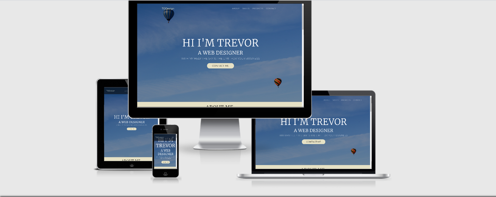
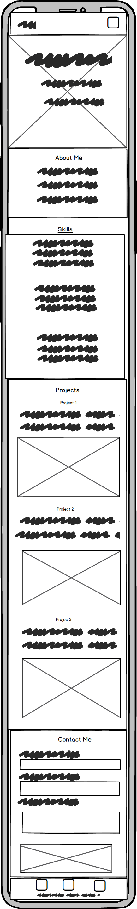
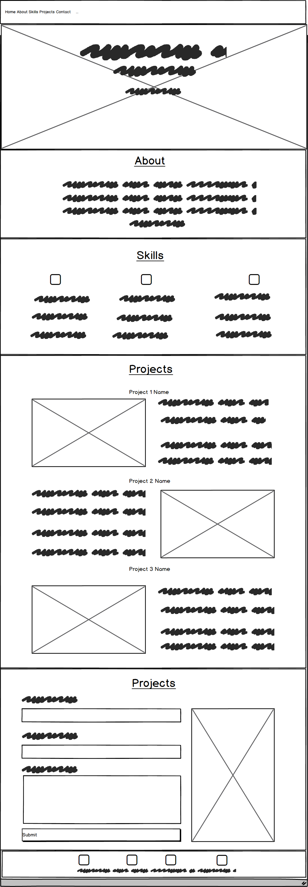

# portfolio_milestone

This project is designed as a one page portfolio project that will demonstrate my ability with using HTML and CSS. The project uses core front end technologies along with the Bootstrap front-end framework for added responsivness and for improved cross browser compatability. The site also takes advantage of Google Fonts to allow for more of a modern feeling typgrophy set.

## Project Description

This project is a one page static portfolio site that I am using to highlight my skills and qualifactions when it comes to front end development. The project consits of seven sections, of which six are main sections that are used to guide the user to get to know more about me and my skills along with providing the user an easy way to contact me if they are interested in my work with a seventh section as the footer. The seven sections and their purpose are as follows:

1. Navigation Bar: this provides navigation around the site.
2. Showcase Section: this is expected to grab the users attention.
3. About Me: this highlights my personality and history.
4. Skills: this higlights my key skills and expertise.
5. Projects: this section draws the users attention to some of the projects that I have worked on.
6. Contact: this section consits of a form to contact me.
7. Footer: This final section is not considerd part of the main sections but it does contain some useful social media links that can be used as an alternative way of contacting me.

## Project Strategy

When creating this project I needed to develop an overall strategy and understand purpose of this project and to keep these ideas in mind when implementing the completed design. This project has a twofold purpose.

1. Demonstrate the skills that I have acquired from the Code Institute curriculam thus far and pass the assesment criteria of Code Institute.
2. Create a fully featured front end project that I can use to draw attention to my skills and attract potential employeers/clients.

With these criteria in mind I determined that a one page static site would be the best option. It would make navigation and organization of the data simple. It would allow me to showcase some of my design ability and allow me to focus on primarily HTML and CSS. The donwside of this approach meant that the site would lack overall complexity and I needed to be careful not to overload the user with too much information in the form of text as this could lead to a very cluttered looking site.

## The Scope of This Project

The main scope of this project was to demonstrate what I have learned thus far in the Code Institute course with regards to HTML and CSS. With this in mind I needed to be careful that I didn't get distracted with trying to be overly complex or to place to much emphasise on things such as JavaScript or JQuery that would not be part of the examination criteria.

A secondary part of the scope for me was to create an attractive site using the above mentioned technologies. For this reason I spent a bit of time deciding the best colour combination, the type of fonts, and the best layout options for this project.

## UI / UX

The layout and content of the site has been carfully curated to logically tell the user the story of my skill set.
The showcase section contains an eye catching heading that introduces me to the user and is designed to grab attention. The about me section informs the user about me and gives them a taste of my personality. The skill section highlights some of my skills and the tech stack that I am comfortable using. The projects section demonstrates the topics that I have discussed in my skills section. Finally the contact section allows the user to get in touch with me after they have learned about my personality, read about my skillset and seen a demonstration of those skills in the project section.

## User Stories

To help develop the site I created some user stories from my perspective as the site owner, along with user stories for potential employeers or clients. By doing this, it helped me to identify what was important information that needed to be included and also helped me to identify things that I could leave out so that the site doesn't become overly bloated with content or difficult to navigate.

### My Perspective:

1. As the owner I would like a site that will act as an introduction to potential employers/clients.
2. As the owner I would like a site that would highlight my technical skills.
3. As the owner I won't like a site that would showcase some of my projects.
4. As the owner I would like a site that would allow a member of the public to contact me.

### Users Perspective:

1. As a user I would like to get a feel for the person that I might hire by reading a bit about them.
2. As a user I would like to get a feel for the tech stack of the owner to see if it is compatible with my business.
3. As a user I would like to see a section of worked on projects as this would give me an ability to judge the site owners skills in a practical setting.
4. As a user I would like to be able to contact the site owner in an easy manner.

# Wireframes.

To help visualize the website I created wireframes of what the site would look like on desktop as well as what it would look like on mobile devices. The wireframes can be found here:

## Mobile Design

## Desktop Design

## Technologies Used

To complete this project I have used a variety of front end technologies.

1. HTML 5: Modern HTML with semantice elements to form the structure of the site.
2. CSS 3: Used to style the site includes flexbox and a grid system for modern layouts and responsive design.
3. Bootsrap: A front end framework that simplifies the grid system and comes with many components and utility classes that help make front end development as easier experience.
4. JQuery: A Javascript library that has been used to add a small amount of dynamism to the website.
5. Google Fonts: Allows for a wider choice of fonts.
6. Coolor.io: a website that was used to help pick the color palette for the site.
7. Github: Used for version control and to store a remote copy of the project.
8. Github pages: a feature of Github that allows us to deploy a static website and have it hosted online.
9. VsCode: An IDE (Integrated Development Environment) that was created by Microsoft was used to build the website.
